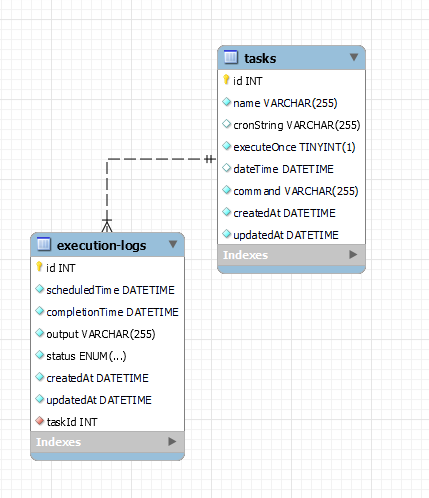

# Cronos

### A reliable and scalable distributed job scheduling system that can execute, manage, and monitor a variety of tasks. The system should support one-time jobs as well as recurring jobs, providing comprehensive job management functionality. While the system will primarily handle backend functionalities, there should be provision for interaction with a potential frontend through well-defined APIs.

1. Job Submission: Implement a mechanism for users to submit jobs that can be executed either immediately or at a specific future time. The submitted jobs can be of various types and complexities.
2. Recurring Jobs: The system should be capable of handling jobs that recur at specified intervals. This could include hourly, daily, weekly, or monthly tasks.
3. Job Management: Create APIs for users to manage their jobs. This should allow them to view the status of their jobs, cancel jobs, and reschedule jobs.
4. Failure Handling: Design a mechanism to handle job failures, with a system for automatic retries. If a job consistently fails, the system should notify the user.
5. Logging and Monitoring: The system should maintain detailed logs of all job executions. Implement a monitoring system that keeps track of job statuses and overall system health.

## [API Documentation (postman docs)](https://documenter.getpostman.com/view/12674486/2s9XxySDw3)

## High Level Design


## Work flow:

```
Task Addition Handling:
- When a task is added it is first created in the tasks table.
- Then it is pushed to the tasks queue.
- Job Manager service listens for messages in tasks queue and creates the jobs to be executed.
- The jobs are  then pushed to redis with appropriate TTL.
- Once the TTL expires, job manager service listens to the expired events and fetches the corresponding jobs from redis.
  - Please refer to redis schema for more information
- After that it enqueues those jobs to Jobs queue from where the Job Executor service deqeues them and takes care of execution

Failure handling:
- If the jobs fail, they are again pushed to redis with TTL of 1 second for retries
- We retry to execute the job for a maximum of 3 times

Post job execution:
- All the execution logs are added to the table execution-logs (passed of failed)
- The job is removed from the redis and corresponding task set

Every midnight a script runs which creates all the jobs for present day and adds them to redis with appropriate TTL.

Task Deletion Handling
- Simply remove all the jobs for that task from redis

Task Modification Handling
- Follow deletion + addition steps
```

## Redis Schema

```
taskId#<taskId>: <set_of_job_Ids>
<jobid>: <job_details>
notifier#<jobid>: <some_ramdom_value> with TTL

Example of job details:
lkybbsl6-jgzof: {"id":"lkybbsl6-jgzof","taskId":2,"dateTime":"2023-08-05T03:00:00Z","command":"test-command","retries":0}
```

## DB Schema



## RabbitMQ queues:

```
 - add_tasks_queue:
    when a new task is added
        producer: task-manager service
        consumer: jobs-manager service

 - delete_tasks_queue:
    when a task is deleted
        producer: task-manager service
        consumer: jobs-manager service

 - modify_tasks_queue:
    when a task is modified
        producer: task-manager service
        consumer: jobs-manager service

 - jobs_queue:
    when a job is to be executed
        producer: jobs-manager service
        consumer: jobs-executor service
```
